# Parallel Reinforcement Learning Report

## Pacman 

We decided to work with the [Pacman environment](https://ale.farama.org/environments/pacman/), which seemed to be an interesting and challenging game.

## The model

The model utilized for these tests is a close approximation of the DeepMind DQN Atari model, used as a reference for many sorts of games in the Atari platform. Observations are normalized to float32 in [0,1] and fed to three convolutional blocks: 16 filters with an 8x8 kernel and stride 4, then 32 filters with a 4x4 kernel and stride 2, and finally 64 filters with a 3x3 kernel and stride 1; all convolution layers use ReLU activations.

## Experiments

We chose the Rennes site and we ran the tests on the Paradoxe cluster, composed of 64 nodes, 128 cpus, 3328 cores, split into:

- paradoxe-[1-32] (32 nodes, 64 cpus, 1664 cores)
- paradoxe-[33-64] (32 nodes, 64 cpus, 1664 cores)

due to a difference in the SSD model.

Common specifications:

- Total Cores per Node: 52 Physical Cores (2 CPUs×26 cores).
- Memory: 384 GiB
- Networking: 25 Gbps
- Total Threads per Node: up to 104 (52 x 2 threads with Intel Hyper-Threading).

We tested different scenarios, changing the number of environment runners and the number of hosts (nodes).

We fixed the following parameters:
- Iterations: 60
- Training batch size: 8000
- Epochs: 10
- Environment per environment runner: 1

We analyzed the perfomance by looking at the following metrics:
- Total training time: The total wall-clock time required to complete all training iterations.
- Mean episode return (reward): The average cumulative reward collected by the agent per episode, indicating how well it is learning the task.
- Episode length: The average number of steps per episode, showing how long episodes last before termination
- Policy loss: A measure of how well the policy network is improving; lower values indicate the policy is learning effectively.
- Value loss: The error in the value function’s predictions of future rewards; smaller values suggest more accurate reward estimation.
- Entropy: A measure of randomness in the policy’s action selection; higher entropy indicates more exploration.
- Environment steps per second: The rate at which the agent interacts with the environment, reflecting sampling throughput and computational efficiency.

We generated 4 graphs to better visualize the results: Sample efficiency (reward vs env steps), Episode length, Losses and entropy, and Environment steps per second.

Note: The throughput graph excludes the first iteration. The initial measurement included Ray worker initialization and environment setup overhead, resulting in an outlier (X steps/sec) that obscured the steady-state performance metrics.

### Results

| Experiment | Final Reward | Max Reward | Mean Reward | Reward Std | Mean Episode Length | Mean Steps/sec |
| --- | --- | --- | --- | --- | --- | --- |
| metrics_1envrunners | 127.79000000000008 | 151.39 | 82.10043055555555 | 35.05970465709116 | 703.3360138888887 | 44.933081579343 |
| metrics_2envrunners | 128.28750000000002 | 257.5375 | 86.55265410958904 | 60.64286957591198 | 730.6539697488585 | 57.32669390951912 |
| metrics_4envrunners | 102.1875 | 102.1875 | 60.906576492537326 | 22.80347487439459 | 938.502139303483 | 66.16930259080075 |
| metrics_8envrunners | 120.32500000000002 | 151.4375 | 85.81225340136055 | 37.92548127820646 | 794.9601573129253 | 71.02742005495423 |
| metrics_16envrunners | 107.8375 | 111.75 | 68.85440883190883 | 26.60861981958292 | 695.885892094017 | 73.48247530354112 |
| metrics_48envrunners | 71.33333333333333 | 90.33333333333331 | 60.075464083938655 | 24.010422146349164 | 611.3496771589993 | 75.6646421836694 |
| metrics_96envrunners | 104.08333333333331 | 104.08333333333331 | 52.108100221309996 | 25.830408052200628 | 585.9487801162471 | 73.7251977142047 |
| metrics_64envrunners | 18.0 | 24.796875 | 18.28372914446646 | 2.420179817337565 | 465.50341306224936 | 74.94770744811187 |
| metrics_2hosts_104envrunners | 52.634615384615394 | 52.634615384615394 | 25.95306044842719 | 11.022670900842188 | 483.58027691275186 | 78.74916946138404 |

**Total Training Time**
We expected a signifcant decrease in the time required to collect the 8000 steps, but the time stabilized between 102-109 minutes. We parallelized the sampling phase (playing the game) by increasing the number of runners. However, the learning phase (calculating gradients and updating the network weights) remained a sequential bottleneck.

**Sample Efficiency**
We expected the rewards to increase, but single-node setups with 1–2 envs had the highest performance. Very high parallelism or multi-node setups might have reduced reward due to unstable learning and synchronization overhead. While 1–2 runners allowed the agent to achieve high mean returns, the 104-runner distributed setup saw a sharp decline.

**Episode Length**
We expected an increase in episode length.

**Losses and Policy Entropy**

**Sample Throughput**

With 1 host, we expected to see an increase in throughput as we increased the number of environment runners, and this was the case. 

With a baseline of 1 environment runner, throughput stabilized between 40–48 steps/s. Increasing to 2 and 4 runners showed a clear upward trajectory, reaching up to 72 steps/s. Beyond 8 runners, the performance gains began to saturate. From 24 to 96 runners, the throughput consistently plateaued between 75 and 80 steps/s, with smaller gains between the configurations. This indicates a system bottleneck.

The transition to a 2-host configuration with 104 environment runners yielded our peak performance. In this distributed setup, throughput consistently revolved around 80 steps/s, frequently peaking above 85 steps/s. While the increase over the 96-runner single-host test was modest, the multi-node setup maintained a higher "floor," with values rarely dipping below 70 steps/s.

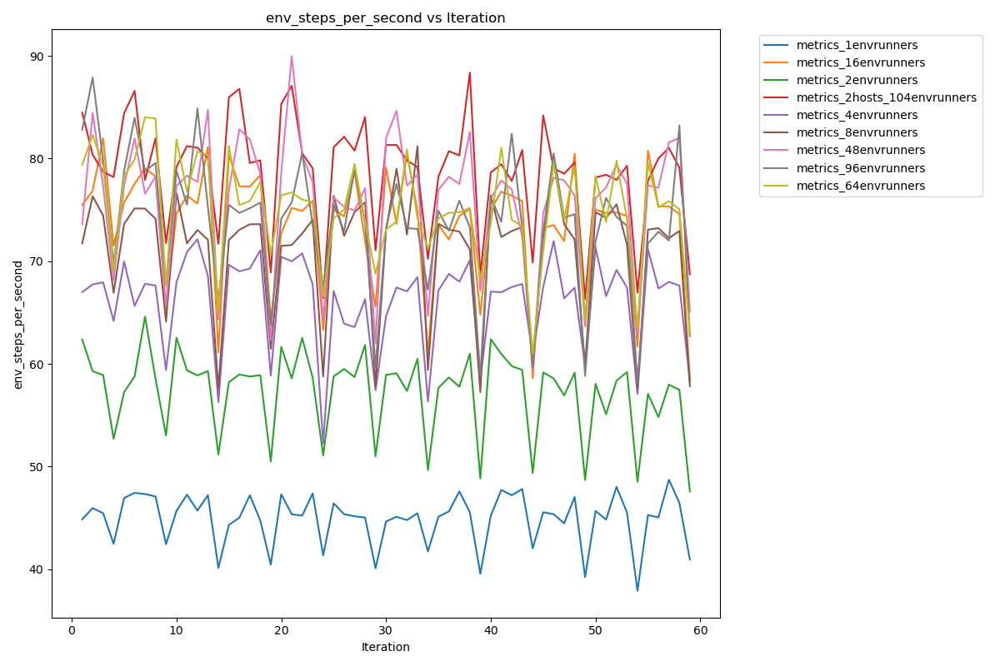

Below can be found a detailed presentation of each experiment. 

### Single host, many environment runners

#### Experiment 1: 1 host, 1 environment runner
Master Node: paradoxe-31.rennes.grid5000.fr

"total_training_time_min": 178.6369121719

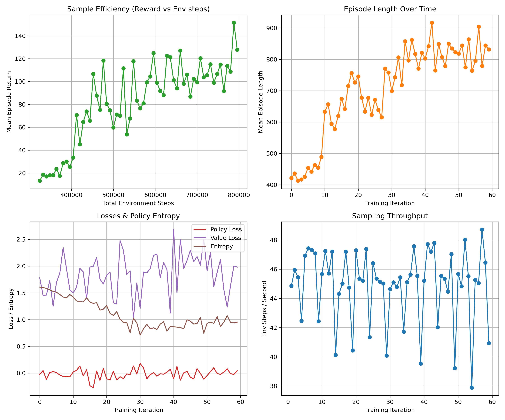

The agent shows slow but steady learning. Initial random performance improves over iterations with increasing rewards and episode lengths, while losses stabilize and entropy decreases as the policy becomes more confident, though throughput remains low due to sequential environment stepping.
- Early iterations (0–5) show low to moderate rewards (~13–24) indicating the policy starts almost random.
- Rewards steadily increase over iterations, reaching ~120–150 toward the end, showing that the agent is learning the Pacman task effectively.
- Episode lengths increase over time, from around 420 steps initially to 800+ steps in later iterations.
- Entropy steadily decreases from ~1.6 initially to ~0.7–1.0 later, meaning the agent is gradually reducing exploration as it becomes more confident in its learned policy.

#### Experiment 2: 1 host, 2 environment runners
Master Node: paradoxe-37.rennes.grid5000.fr

"total_training_time_min": 140.23255457173335

- 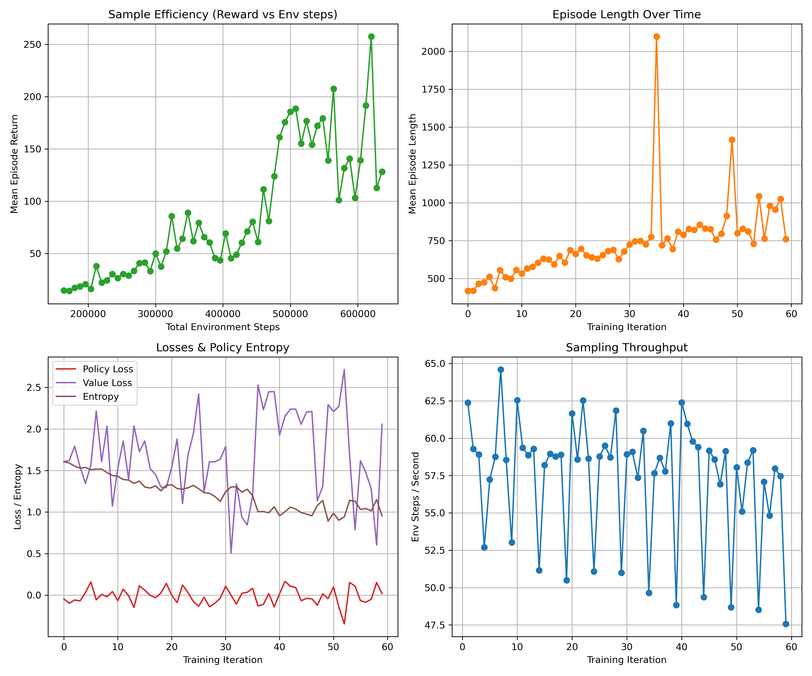

The training logs show that the agent initially learns steadily, with average episode rewards rising from around 14 to over 300, indicating effective early learning and exploitation of the environment. Episode lengths also increase, reflecting more complex or sustained behaviors. However, over time the policy entropy drops sharply, especially by the end, signaling that the policy has become almost deterministic. This is accompanied by highly negative policy loss and near-zero value loss, suggesting instability or collapse in training. Overall, while the agent achieves high rewards, the sharp decline in entropy and erratic loss values indicate overfitting and reduced exploration.

#### Experiment 3: 1 host, 4 environment runners
Master Node: paradoxe-38.rennes.grid5000.fr

"total_training_time_min": 120.48174038546671

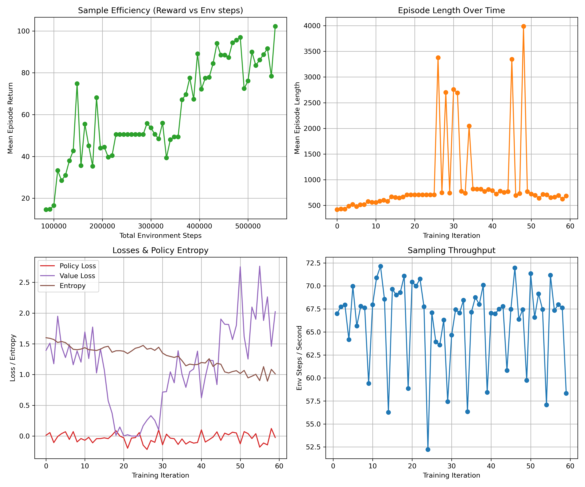

#### Experiment 4: 1 host, 8 environment runners
Master Node: paradoxe-38.rennes.grid5000.fr

"total_training_time_min": 113.52636106498333

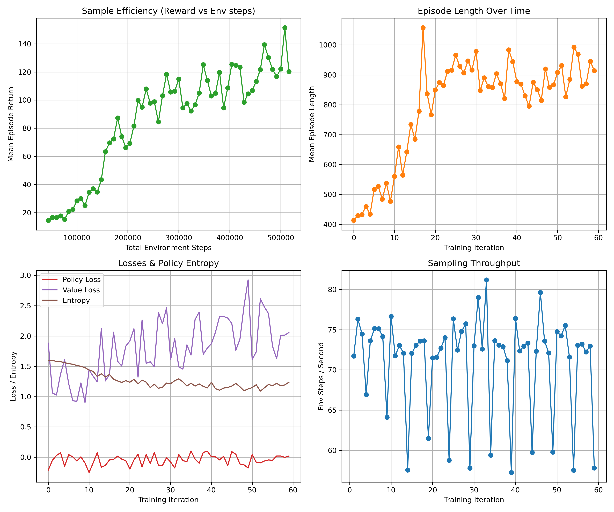

####  Experiment 5: 1 host, 16 environment runners
Master Node: paradoxe-38.rennes.grid5000.fr

"total_training_time_min": 109.55379682653334

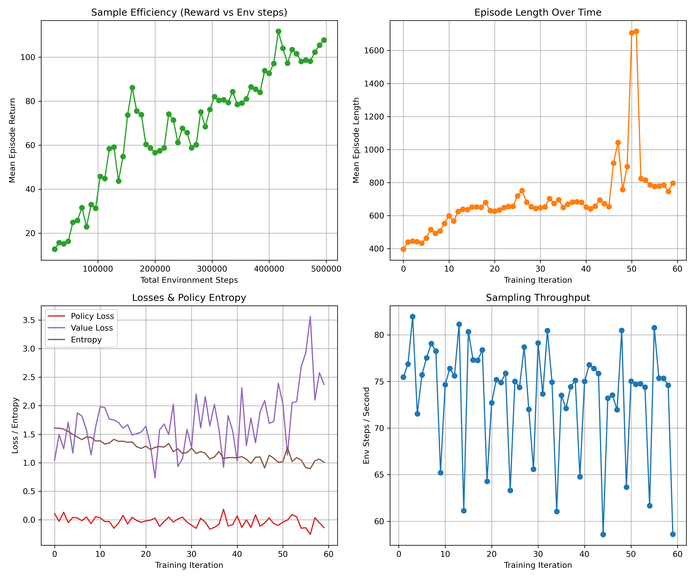

#### Experiment 6: 1 host, 24 environment runners
Master Node: paradoxe-34.rennes.grid5000.fr

"total_training_time_min": 111.39740566156664

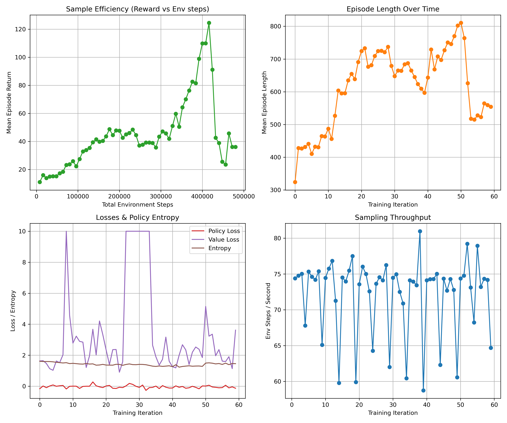

#### Experiment 7: 1 host, 32 environment runners
Master Node: paradoxe-38.rennes.grid5000.fr

"total_training_time_min": 110.43792185884995

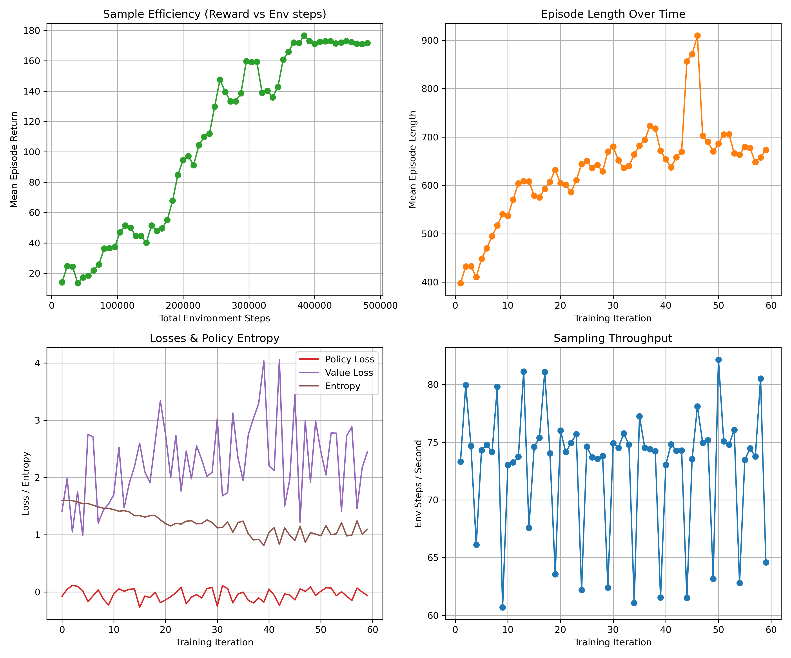

#### Experiment 8: 1 host, 48 environment runners
Master Node: paradoxe-34.rennes.grid5000.fr

"total_training_time_min": 106.55379682653334

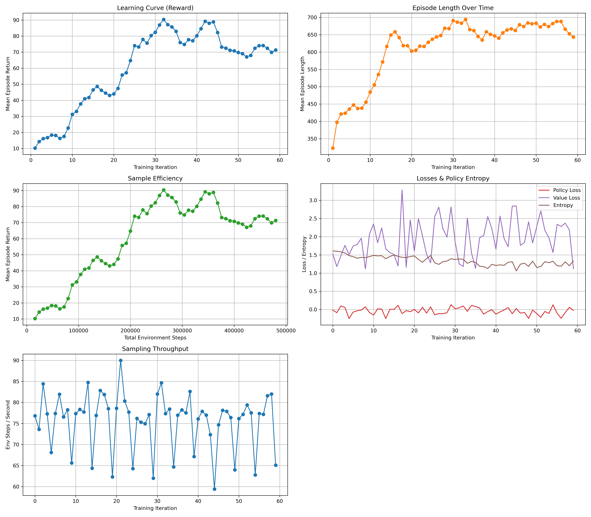

#### Experiment 9: 1 host, 64 environment runners
Master Node: paradoxe-34.rennes.grid5000.fr

"total_training_time_min": 107.19128965038335

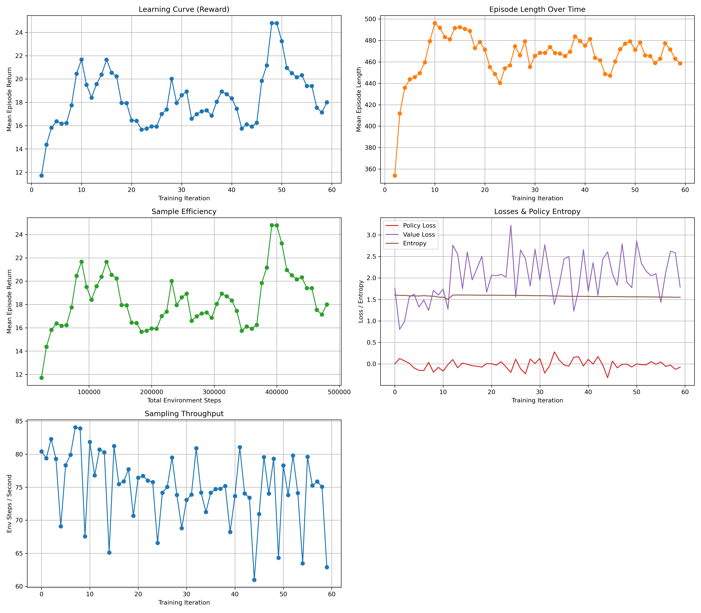

#### Experiment 10: 1 host, 96 environment runners
Master Node: paradoxe-38.rennes.grid5000.fr

"total_training_time_min": 109.33933907701666

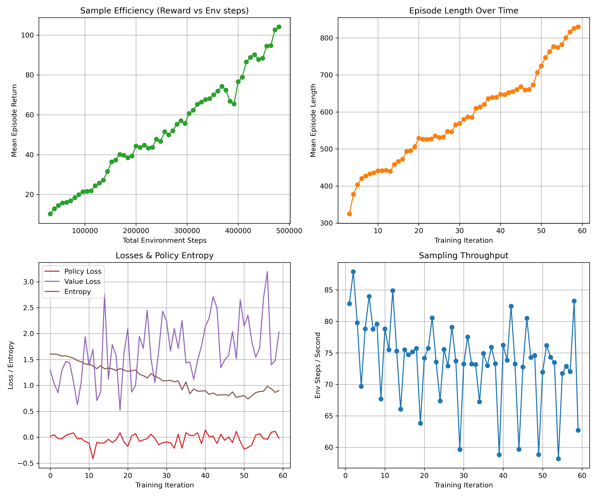

#### Experiment 11: 1 host, 104 environment runners
Master Node: paradoxe-38.rennes.grid5000.fr

It was not possible to scale up to 104 environment runners with a single host. We got the following error until the job was killed:

- The following resource request cannot be scheduled right now: {'CPU': 1.0}. 

After that, we tried to test 104 environment runners with 2 hosts. Results can be found below.

#### Experiment 12: 1 host, 100 environment runners

Master Node: paradoxe-34.rennes.grid5000.fr

Batch size: 8k

### Many hosts, many environment runners 

#### Experiment 13: 2 hosts, 104 environment runners

Master Node: paradoxe-34.rennes.grid5000.fr
Worker Nodes: paradoxe-38.rennes.grid5000.fr

Hoping to benefit from horizontal scaling, we tested a configuration with 2 hosts and 104 environment runners, but the results did not show an improvement as we had expected. The Mean Episode Return was lower than all the previous tests with 1 host, and the throughput was around 80 steps/s. After some research, we understood that the 104 environment runners were divided into the 2 hosts, so we would not be able to a "better" training. The same holds for the following experiment we did, with 96 runners.

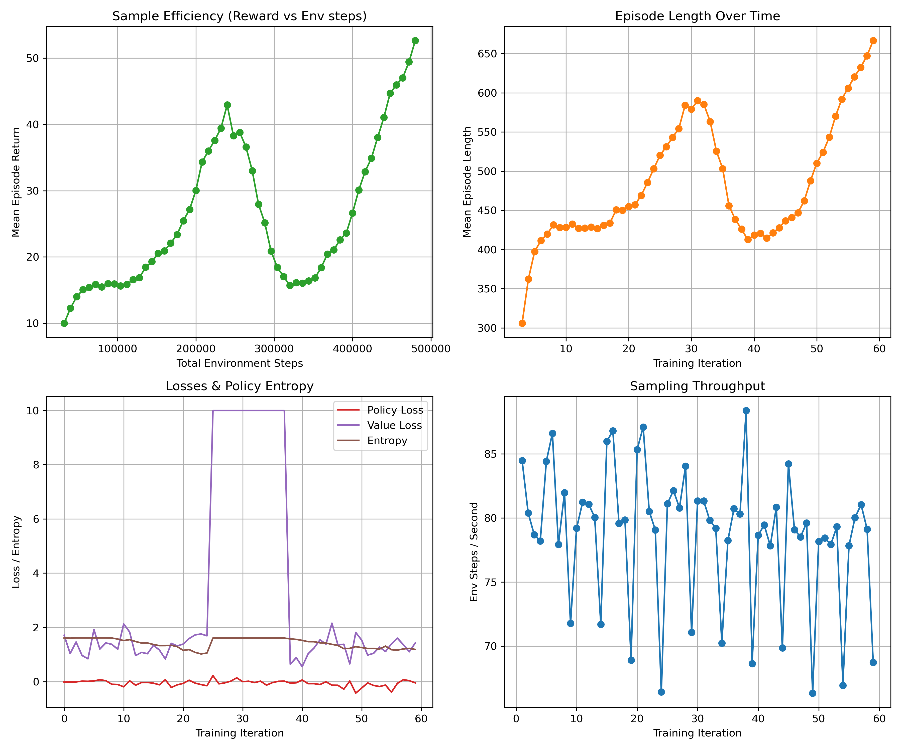

#### Experiment 14: 2 host, 96 environment runners

Master Node: paradoxe-34.rennes.grid5000.fr
Worker Nodes: paradoxe-38.rennes.grid5000.fr

We understood that the fact that the training with 96 environment runners and 2 hosts led to worse results than the training with 1 host and the same number of runners could have been expected, since we divide the runners, but we do not profit from the added resources, since we did not change anything else in the configuration. 

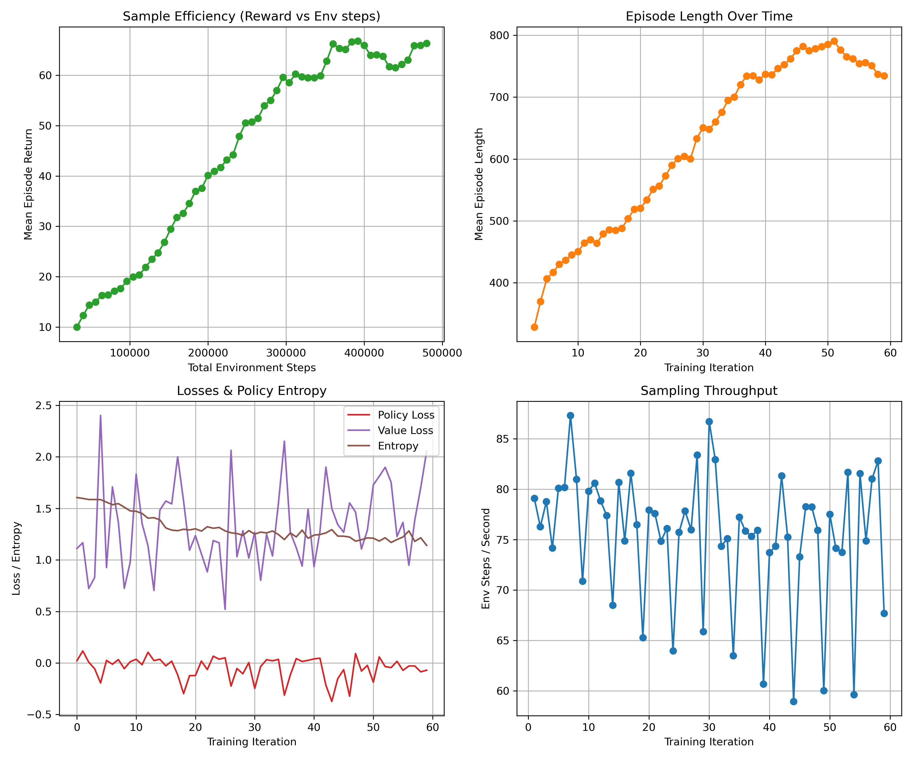

#### Experiment 15: 2 host, 200 environment runners

Master Node: paradoxe-34.rennes.grid5000.fr

Worker Nodes: paradoxe-38.rennes.grid5000.fr

Batch size: 16k

We were unable to finish this experiment as it took longer than 3 hours, which was the time limit we stipulated. At the end of three hours, it had reached iteration 51 and achieved increasing returns, reaching 90 in the last iteration, which is lower than what had been achieved in 1-node configurations. The throughput was similar to the other experiments, varying around 75 and 80 steps/s. 

#### Experiment 16: 4 host, 400 environment runners

Master Node: paradoxe-34.rennes.grid5000.fr

Worker Nodes: paradoxe-38.rennes.grid5000.fr

Batch size: 32k

#### Experiment 17: 8 host, 800 environment runners

Master Node: paradoxe-34.rennes.grid5000.fr

Worker Nodes: paradoxe-38.rennes.grid5000.fr

Batch size: 64k

## Contributions

- Vinicius Lazzari developed the core training pipeline, which includes a custom Gymnasium wrapper for Atari Pacman, the distributed PPO configuration with a  CNN architecture, and a logging system.
- Laura Keidann implemented the data export system with the relevant metrics and developed the plot_results.py script to generate the performance dashboards and training charts automatically.

Initially, both students conducted preliminary tests to explore the information that could be gathered from the metrics. Then, a final testing plan was developed. The experiments were divided between the two students, who then analyzed together the final results and collaborated on the report.
