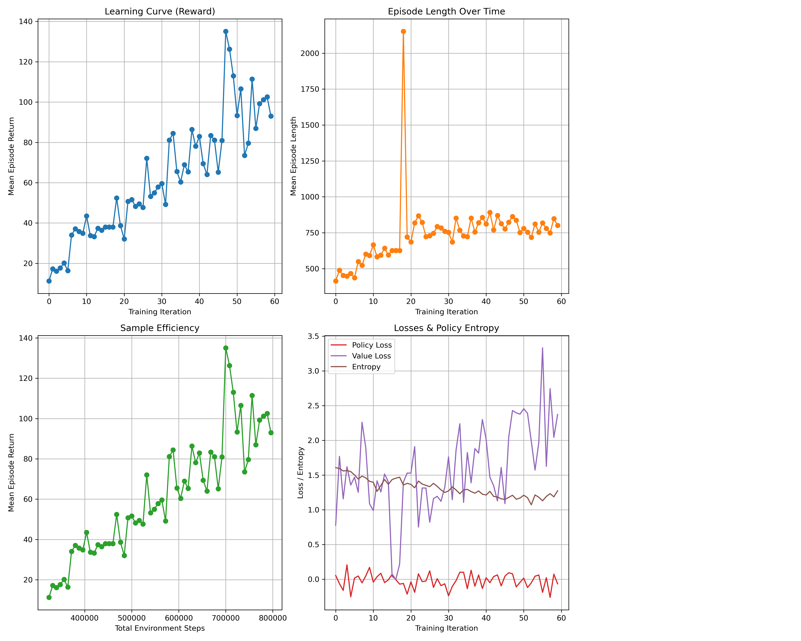
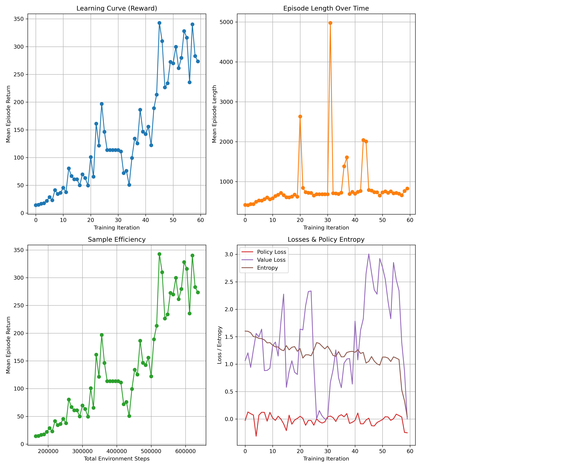
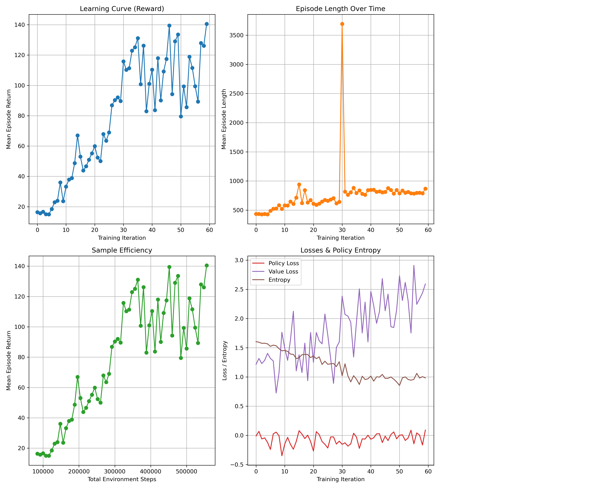
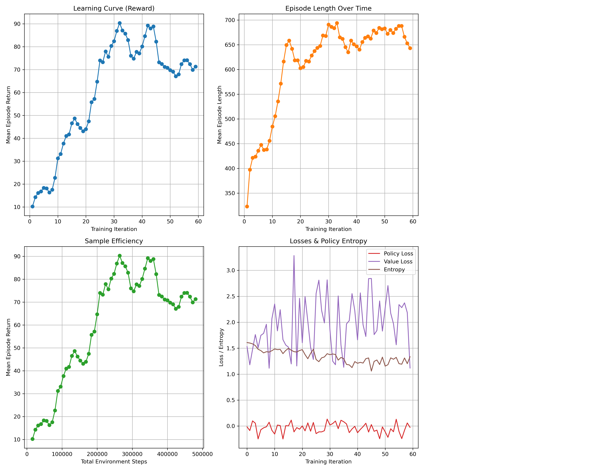
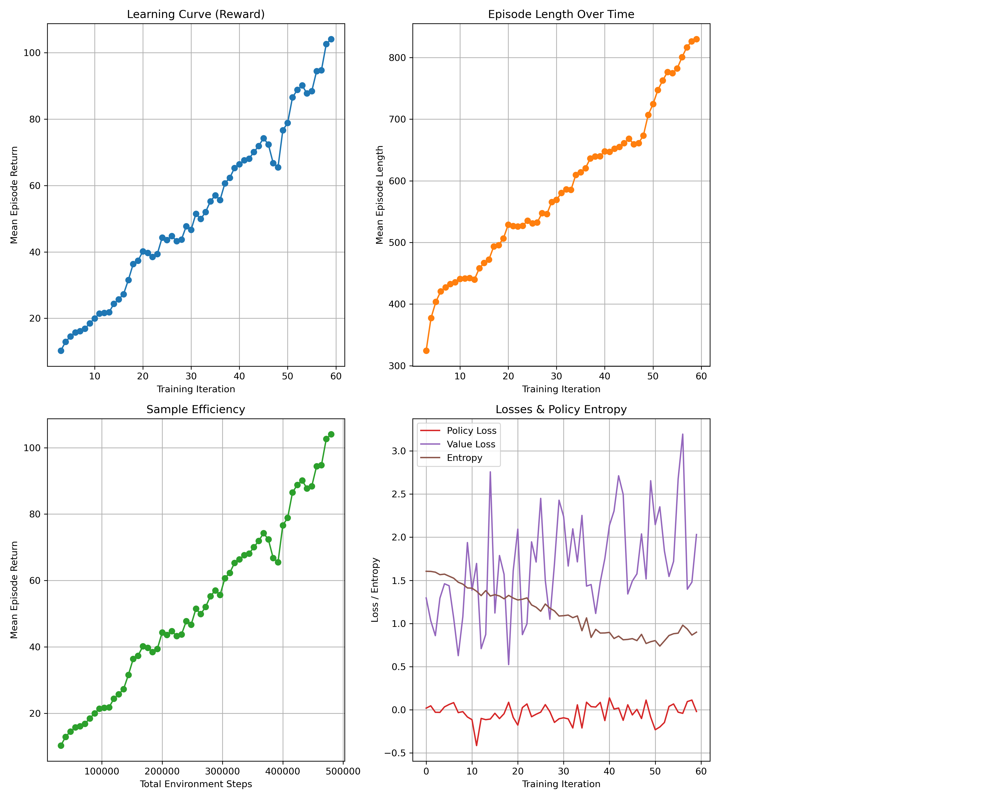

# Report

We have tested different setups, changing the number of hosts (nodes) and the number of environment runners.

## Experiment 1: 1 host, 1 environment runner

Master Node: paradoxe-31.rennes.grid5000.fr
Worker Nodes: (none)

- 60 iterations, 1 env runner, 1 env per env runner
- batch size: 8000, epochs: 10
- 176 min

Early iterations (0–10) have smaller rewards (~11–50) and more fluctuations, but from iterations 30–59, rewards are higher and more consistently around 80–130, though some spikes/decreases exist. Mean episode reward increases from approximately 11 in the first iteration to over 90 by the last iteration, indicating effective learning. Some fluctuations remain due to exploration, but the overall trend shows consistent improvement in policy performance.

## Experiment 2: 1 host, 2 environment runners

Master Node: paradoxe-37.rennes.grid5000.fr
Worker Nodes: (none)

- 60 iterations, 2 env runners, 1 env per env runner
- batch size: 8000, epochs: 10
- 141 min

The training logs show that the agent initially learns steadily, with average episode rewards rising from around 14 to over 300, indicating effective early learning and exploitation of the environment. Episode lengths also increase, reflecting more complex or sustained behaviors. However, over time the policy entropy drops sharply, especially by the end, signaling that the policy has become almost deterministic. This is accompanied by highly negative policy loss and near-zero value loss, suggesting instability or collapse in training. Overall, while the agent achieves high rewards, the sharp decline in entropy and erratic loss values indicate overfitting and reduced exploration.

## Experiment 3: 1 host, 4 environment runners
Master Node: paradoxe-38.rennes.grid5000.fr
Worker Nodes: (none)

- 60 iterations, 2 env runners, 1 env per env runner
- batch size: 8000, epochs: 10
- 120 min

## Experiment 4: 1 host, 8 environment runners

## Experiment 5: 1 host, 16 environment runners

## Experiment 6: 1 host, 24 environment runners

## Experiment 7: 1 host, 32 environment runners

## Experiment 8: 1 host, 48 environment runners
Master Node: paradoxe-34.rennes.grid5000.fr
Worker Nodes: (none)

"total_training_time_min": 106.57946914085,

## Experiment 9: 1 host, 64 environment runners

Master Node: paradoxe-34.rennes.grid5000.fr
Worker Nodes: (none)

"total_training_time_min": 107.19128965038335,

## Experiment 10: 1 host, 96 environment runners

Master Node: paradoxe-38.rennes.grid5000.fr
Worker Nodes: (none)

"total_training_time_min": 109.33933907701666,

## Experiment 11: 1 host, 104 environment runners