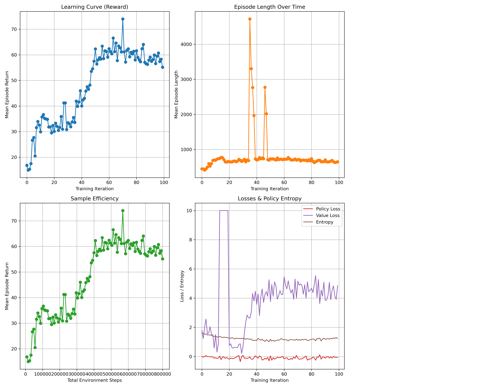
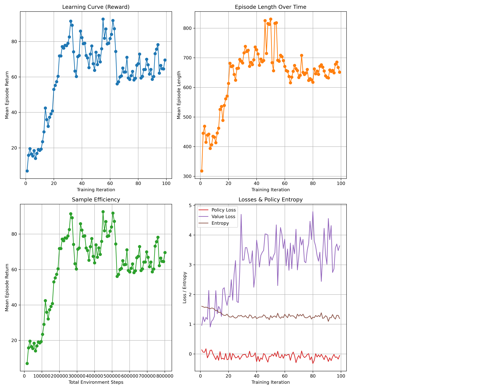

# Report

We have tested different setups, changing the number of hosts (nodes) and the number of environment runners.

## Experiment 1: 1 host, 1 core, 1 environment runner

Baseline: single CPU, single worker, single env. 

## Experiment 2: 2 hosts, 8 env runners, 1 env per runner

- Total time: 2 hours 48 minutes (10077.2967520411 seconds)
- The agent’s rewards steadily increase over training, rising from ~16 to ~60–70 and fluctuating around 60.

## Experiment 2: 1 host, 2 cores, 2 env runners, 1 env per worker

## Experiment 3: 1 host, 2 cores, 1 env runner, 2 envs per worker

## Experiment 4: 1 host, 4 cores, 4 env runner, 1 env per worker
   

## Experiment 5: 2 hosts, 1 core per node, 1 env runner, 1 env per worker

## Experiment 6: 2 hosts, 2 cores per node, 2 env runners, 1 env per worker

## Experiment 7: 2 hosts, 2 cores per node, 1 env runner, 2 envs per worker

## Experiment 8: 2 hosts, 4 cores per node, 4 env runners, 1 env per worker
 
Experiments with 2 envs per worker
## Experiment 9: 1 host, 24 env runners (48 total)

## Experiment 10: 2 hosts, 24 env runners (48 total)

## Experiment 11: 4 hosts, 24 env runners (48 total)

## Experiment 12: 1 host, 4 env runners (48 total)

## Experiment 13: 1 host, 24 env runners (48 total)

## Experiment 14: 2 hosts, 24 env runners (48 total)

## Experiment 15: 4 hosts, 24 env runners (48 total)
- hosts = 4
- num_env_runners=24, num_envs_per_env_runner=2

